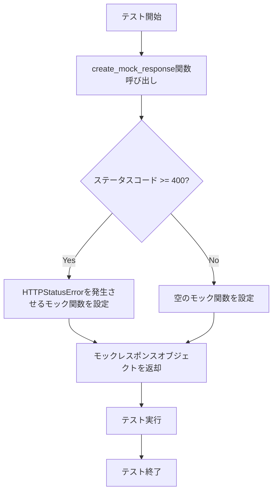
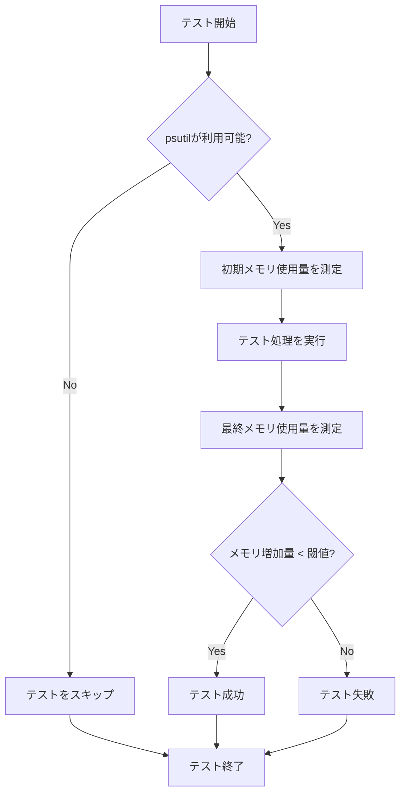

# 設計ドキュメント

## 概要

このドキュメントでは、Phaser MCP Serverのパフォーマンステストにおけるモックオブジェクトの設定問題を解決するための設計を詳述します。主な問題は、`test_memory_usage_performance`テストにおけるモックオブジェクトの設定と`psutil`モジュールの使用方法にあります。この設計では、テストの信頼性と再現性を向上させるための修正アプローチを提案します。

## アーキテクチャ

パフォーマンステストは`tests/test_end_to_end.py`ファイル内の`TestPerformance`クラスに実装されています。このクラスには以下のテストメソッドが含まれています：

1. `test_read_documentation_performance` - 大きなHTMLコンテンツの処理パフォーマンスをテスト
2. `test_pagination_performance` - ページネーション処理のパフォーマンスをテスト
3. `test_concurrent_requests_performance` - 並行リクエストのパフォーマンスをテスト
4. `test_memory_usage_performance` - メモリ使用量のパフォーマンスをテスト
5. `test_api_reference_performance` - API参照取得のパフォーマンスをテスト

これらのテストは、モックオブジェクトを使用してHTTPリクエストをシミュレートし、処理時間やメモリ使用量などのパフォーマンス指標を測定します。

## コンポーネントとインターフェース

### モックオブジェクト

モックオブジェクトは`unittest.mock.Mock`クラスを使用して作成され、HTTPレスポンスをシミュレートします。主な問題点は以下の通りです：

1. モックレスポンスオブジェクトの属性設定が不完全
2. `_content`属性の設定方法が不適切
3. `raise_for_status`メソッドの実装が不十分

### パフォーマンス測定

パフォーマンス測定には以下のコンポーネントが使用されています：

1. `time.time()` - 処理時間の測定
2. `psutil.Process` - メモリ使用量の測定
3. `asyncio.gather` - 並行リクエストのシミュレーション

## データモデル

テストで使用される主なデータ構造：

1. `MockContext` - MCPコンテキストをシミュレートするクラス
2. モックHTTPレスポンス - `httpx.Response`オブジェクトをシミュレート
3. 大きなHTMLコンテンツ - パフォーマンステスト用のデータ

## エラー処理

現在のエラー処理の問題点：

1. `psutil`モジュールが利用できない場合の対応が不十分
2. メモリ使用量の閾値が環境に依存している
3. テスト失敗時のエラーメッセージが不明確

## テスト戦略

改善されたテスト戦略：

1. **モックオブジェクトの強化**
   - 完全なモックレスポンスオブジェクトの作成
   - `_content`属性の適切な設定
   - `raise_for_status`メソッドの適切な実装

2. **環境依存性の軽減**
   - `psutil`モジュールの可用性チェック
   - 環境に依存しないメモリ使用量の閾値設定
   - テスト環境の初期状態の正規化

3. **テストの堅牢性向上**
   - テスト前後のリソースクリーンアップ
   - 一貫した結果を得るためのテスト条件の標準化
   - 明確なエラーメッセージの提供

## 実装詳細

### 1. モックレスポンスオブジェクトの改善

```python
def create_mock_response(url, content, status_code=200, content_type="text/html"):
    """標準化されたモックレスポンスオブジェクトを作成する。
    
    Args:
        url: レスポンスのURL
        content: レスポンスの内容（文字列）
        status_code: HTTPステータスコード
        content_type: コンテンツタイプヘッダー
        
    Returns:
        設定されたモックレスポンスオブジェクト
    """
    mock_response = Mock()
    mock_response.text = content
    mock_response.status_code = status_code
    mock_response.headers = {"content-type": content_type}
    mock_response.url = url
    
    # バイナリコンテンツの適切な設定
    mock_response._content = content.encode("utf-8")
    
    # raise_for_status メソッドの適切な実装
    def raise_for_status():
        if status_code >= 400:
            from httpx import HTTPStatusError
            raise HTTPStatusError(f"HTTP Error: {status_code}", request=None, response=mock_response)
    
    mock_response.raise_for_status = raise_for_status
    
    return mock_response
```

### 2. メモリ使用量テストの改善

```python
def get_memory_usage():
    """現在のプロセスのメモリ使用量を取得する。
    
    Returns:
        メモリ使用量（MB）またはNone（psutilが利用できない場合）
    """
    try:
        import psutil
        import os
        process = psutil.Process(os.getpid())
        return process.memory_info().rss / 1024 / 1024  # MB
    except (ImportError, AttributeError):
        return None
```

### 3. テスト条件の標準化

```python
@pytest.fixture
def setup_test_environment():
    """テスト環境をセットアップし、一貫した初期状態を確保する。"""
    # ガベージコレクションを強制実行して初期状態をクリーンにする
    import gc
    gc.collect()
    
    # テスト前の状態を記録
    initial_state = {
        "memory": get_memory_usage()
    }
    
    yield initial_state
    
    # テスト後のクリーンアップ
    gc.collect()
```

## 図表

### モックオブジェクト改善のフロー



### メモリ使用量テストのフロー


