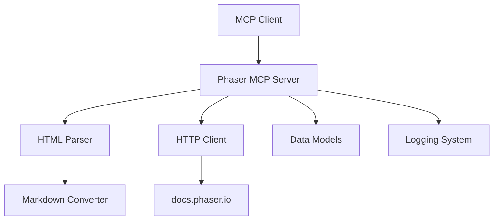

# 設計書

## 概要

Phaser MCP Serverは、Model Context Protocol (MCP) を通じてPhaserゲームエンジンの公式ドキュメントへのアクセスを提供するサーバーです。AWS Documentation MCP Serverのアーキテクチャをベースとし、Phaserドキュメント（<https://docs.phaser.io/）に特化した機能を提供します。>

このサーバーは、AIアシスタントがPhaserの公式ドキュメント、APIリファレンス、チュートリアル、サンプルコードに効率的にアクセスできるようにし、ゲーム開発者の作業を支援します。

## アーキテクチャ

### 全体構成



### レイヤー構成

1. **MCP Interface Layer**: FastMCPを使用したMCPプロトコル実装
2. **Business Logic Layer**: ドキュメント取得、検索、パース処理
3. **HTTP Client Layer**: Phaserドキュメントサイトへのリクエスト処理
4. **Data Processing Layer**: HTML解析とMarkdown変換
5. **Model Layer**: データ構造とバリデーション

## コンポーネントと インターフェース

### 主要コンポーネント

#### 1. Server Module (`server.py`)

- **責任**: MCPサーバーのメイン実装、ツール定義
- **主要機能**:
  - FastMCPサーバーの初期化
  - MCPツールの定義と実装
  - エラーハンドリングとログ記録
- **公開インターフェース**:
  - `read_documentation(url, max_length, start_index)`: ドキュメントページの取得
  - `search_documentation(query, limit)`: ドキュメント検索
  - `get_api_reference(class_name)`: APIリファレンス取得

#### 2. Client Module (`client.py`)

- **責任**: PhaserドキュメントサイトへのHTTPリクエスト処理
- **主要機能**:
  - HTTPクライアントの管理
  - リクエスト/レスポンス処理
  - レート制限とリトライ処理
- **公開インターフェース**:
  - `fetch_page(url)`: 単一ページの取得
  - `search_content(query)`: 検索リクエスト
  - `get_page_content(url)`: ページコンテンツの取得

#### 3. Parser Module (`parser.py`)

- **責任**: HTML解析とMarkdown変換
- **主要機能**:
  - HTMLコンテンツの解析
  - Markdownへの変換
  - コードブロックとフォーマットの保持
- **公開インターフェース**:
  - `parse_html_to_markdown(html)`: HTML→Markdown変換
  - `extract_code_examples(html)`: コード例の抽出
  - `clean_content(content)`: コンテンツのクリーニング

#### 4. Models Module (`models.py`)

- **責任**: データモデルとバリデーション
- **主要機能**:
  - Pydanticモデルの定義
  - データバリデーション
  - 型安全性の確保
- **データモデル**:
  - `DocumentationPage`: ドキュメントページ情報
  - `SearchResult`: 検索結果
  - `ApiReference`: APIリファレンス情報

### インターフェース設計

#### MCP Tools Interface

```python
# ドキュメント読み込みツール
@mcp.tool()
async def read_documentation(
    ctx: Context,
    url: str,
    max_length: int = 5000,
    start_index: int = 0
) -> str

# ドキュメント検索ツール
@mcp.tool()
async def search_documentation(
    ctx: Context,
    query: str,
    limit: int = 10
) -> List[SearchResult]

# APIリファレンス取得ツール
@mcp.tool()
async def get_api_reference(
    ctx: Context,
    class_name: str
) -> str
```

## データモデル

### DocumentationPage

```python
class DocumentationPage(BaseModel):
    url: str
    title: str
    content: str
    last_modified: Optional[datetime] = None
    content_type: str = "text/html"
```

### SearchResult

```python
class SearchResult(BaseModel):
    rank_order: int
    url: str
    title: str
    snippet: Optional[str] = None
    relevance_score: Optional[float] = None
```

### ApiReference

```python
class ApiReference(BaseModel):
    class_name: str
    url: str
    description: str
    methods: List[str] = []
    properties: List[str] = []
    examples: List[str] = []
```

## エラーハンドリング

### エラー分類と対応

#### 1. ネットワークエラー

- **HTTPエラー**: 接続失敗、タイムアウト
- **対応**: 指数バックオフによるリトライ、適切なエラーメッセージ

#### 2. コンテンツエラー

- **無効なURL**: 存在しないページ、アクセス拒否
- **対応**: URL検証、404エラーの適切な処理

#### 3. パースエラー

- **HTML解析失敗**: 不正なHTML、予期しない構造
- **対応**: フォールバック処理、部分的な内容の返却

#### 4. レート制限

- **アクセス制限**: サーバー側の制限
- **対応**: 適切な待機時間、リクエスト頻度の調整

### エラーハンドリング戦略

```python
async def handle_request_error(error: Exception, url: str) -> str:
    if isinstance(error, httpx.TimeoutException):
        return f"タイムアウト: {url} への接続がタイムアウトしました"
    elif isinstance(error, httpx.HTTPStatusError):
        return f"HTTPエラー {error.response.status_code}: {url}"
    else:
        return f"予期しないエラー: {str(error)}"
```

## テスト戦略

### テストレベル

#### 1. 単体テスト

- **対象**: 各モジュールの個別機能
- **ツール**: pytest, pytest-asyncio
- **カバレッジ**: 90%以上を目標

#### 2. 統合テスト

- **対象**: モジュール間の連携
- **ツール**: pytest-mock, httpx-mock
- **重点**: HTTP通信、データ変換

#### 3. エンドツーエンドテスト

- **対象**: MCP通信全体
- **ツール**: MCP test client
- **重点**: 実際のユースケース

### テスト構成

```
tests/
├── unit/
│   ├── test_server.py      # サーバーロジックのテスト
│   ├── test_client.py      # HTTPクライアントのテスト
│   ├── test_parser.py      # パーサーのテスト
│   └── test_models.py      # データモデルのテスト
├── integration/
│   ├── test_mcp_tools.py   # MCPツールの統合テスト
│   └── test_end_to_end.py  # エンドツーエンドテスト
└── fixtures/
    ├── sample_pages.html   # テスト用HTMLファイル
    └── mock_responses.json # モックレスポンス
```

### モック戦略

```python
# HTTPリクエストのモック
@pytest.fixture
def mock_phaser_docs():
    with httpx_mock.HTTPXMock() as m:
        m.add_response(
            url="https://docs.phaser.io/phaser/",
            html="<html>...</html>"
        )
        yield m

# MCP Context のモック
@pytest.fixture
def mock_mcp_context():
    return Mock(spec=Context)
```

## 設定とデプロイメント

### 環境変数

```bash
# ログレベル設定
FASTMCP_LOG_LEVEL=ERROR

# リクエスト設定
PHASER_DOCS_TIMEOUT=30
PHASER_DOCS_MAX_RETRIES=3

# キャッシュ設定（将来の拡張用）
PHASER_DOCS_CACHE_TTL=3600
```

### パッケージ設定

```toml
[project]
name = "phaser-mcp-server"
version = "1.0.0"
description = "MCP Server for Phaser Game Engine Documentation"
requires-python = ">=3.14"
dependencies = [
    "mcp[cli]>=1.11.0",
    "httpx>=0.28.0",
    "beautifulsoup4>=4.13.0",
    "markdownify>=1.2.0",
    "pydantic>=2.11.0",
    "loguru>=0.8.0",
]

[project.scripts]
"phaser-mcp-server" = "phaser_mcp_server.server:main"
```

### Docker設定

```dockerfile
FROM python:3.14-slim

WORKDIR /app
COPY . .
RUN pip install -e .

EXPOSE 8000
CMD ["phaser-mcp-server"]
```

### MCP クライアント設定

```json
{
  "mcpServers": {
    "phaser-mcp-server": {
      "command": "uvx",
      "args": ["phaser-mcp-server@latest"],
      "env": {
        "FASTMCP_LOG_LEVEL": "ERROR"
      },
      "disabled": false,
      "autoApprove": []
    }
  }
}
```

## パフォーマンス考慮事項

### 最適化戦略

1. **HTTP接続の再利用**: httpx.AsyncClientの適切な管理
2. **コンテンツキャッシュ**: 頻繁にアクセスされるページのキャッシュ
3. **並行処理**: 複数リクエストの並行実行
4. **メモリ効率**: 大きなドキュメントのストリーミング処理

### リソース制限

- **メモリ使用量**: 最大100MB
- **同時接続数**: 最大10接続
- **リクエストタイムアウト**: 30秒
- **レスポンスサイズ**: 最大1MB per request

## セキュリティ考慮事項

### セキュリティ対策

1. **URL検証**: Phaserドメインのみアクセス許可
2. **入力サニタイゼーション**: XSS攻撃の防止
3. **レート制限**: DoS攻撃の防止
4. **ログ記録**: セキュリティイベントの記録

### 実装例

```python
def validate_phaser_url(url: str) -> bool:
    """Phaserドキュメントの有効なURLかチェック"""
    allowed_domains = [
        "docs.phaser.io",
        "phaser.io"
    ]
    parsed = urlparse(url)
    return parsed.netloc in allowed_domains and parsed.scheme in ["http", "https"]
```
